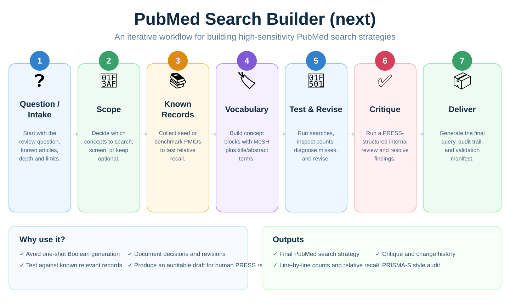
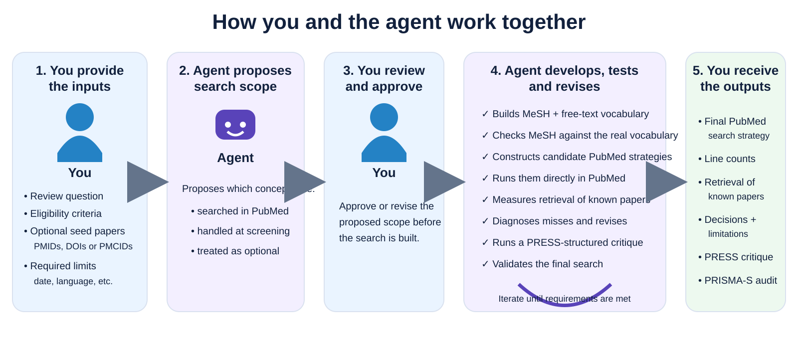
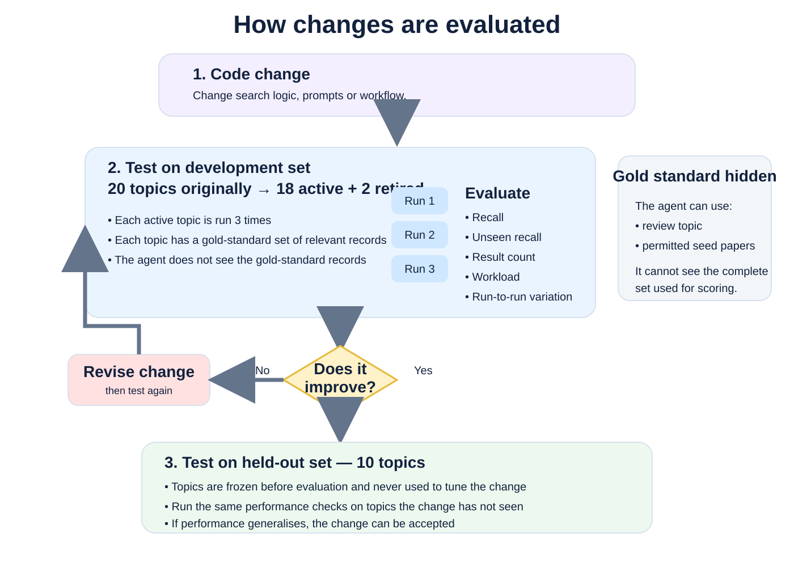

# PubMed Search Builder (next)

PubMed Search Builder is an agent skill for **Codex and Claude Code** that develops high-sensitivity PubMed search strategies for systematic reviews, scoping reviews, rapid reviews, and other evidence syntheses.

Give it a review question and, optionally, known relevant papers. The agent develops the search iteratively, **pilots and tests candidate strategies directly in PubMed via its API**, diagnoses misses, revises the strategy, runs a PRESS-structured critique, validates the final query, and produces an auditable search ready for human review.

> **This is not just an LLM Boolean-query generator. It is an agentic search-development workflow.**



## What happens when you use it?

You provide the **review question** and can optionally supply **seed papers that you already know are relevant**.

If you do not have known relevant papers, the workflow can still proceed. At **standard** or **thorough** depth, the agent first tries to establish its own set of known relevant records. It may look for a suitable prior systematic review and screen its included studies, run narrow high-precision pilot searches, and expand from confirmed relevant records using PubMed relationships such as similar articles and citation links. Candidates are screened against the review's eligibility criteria before they are used.

Most of these records are used to develop and check the search. When there are enough of them, and some were screened in a separate context so the agent building the search never saw them, a share is **held out** for one retrieval test of the finished query. You decide whether to keep that held-out test or use everything for development. If too few suitable records can be established, the search can still be built, but the audit makes clear that the empirical evidence for recall is limited or absent. At **quick** depth, discovery is limited to about 30 screened candidates and no held-out test is created automatically.

The agent then proposes which concepts should be represented in the PubMed search and which are better assessed during screening. **You approve or revise this scope decision before the main search is built.**

The agent then:

1. builds MeSH and free-text vocabulary;
2. checks MeSH headings against the actual vocabulary;
3. constructs candidate PubMed strategies;
4. **runs and tests them directly in PubMed via the API**;
5. measures whether known relevant records are retrieved;
6. diagnoses which concept blocks caused any misses;
7. revises and retests the strategy;
8. runs a PRESS-structured internal critique; and
9. revalidates the final search before delivery.

You receive the final PubMed strategy, line-by-line counts, retrieval results for known relevant papers, documented decisions and limitations, and a PRISMA-S-style audit.



## Why use it?

LLMs can produce convincing PubMed search strings that still have serious retrieval problems. They may **hallucinate MeSH headings that do not exist**, use real MeSH terms incorrectly, AND too many concepts, search outcomes or comparators unnecessarily, generate syntax that PubMed interprets differently from what was intended, or stop after producing the first plausible-looking query.

A search can look sophisticated without ever being tested against PubMed or against records that it should retrieve.

PubMed Search Builder adds an empirical search-development loop around the model:

- **Scope before vocabulary.** The agent proposes which concepts belong in the search and which are better left to screening. The user approves or revises this decision before development continues.
- **Verified MeSH plus free text.** MeSH headings are checked against the actual vocabulary rather than assumed to exist. Each searched concept is represented using controlled vocabulary and appropriate title/abstract terms.
- **Test against PubMed, not just the model's intuition.** Candidate strategies are executed directly in PubMed via its API. The workflow examines result counts, PubMed translations, known-record retrieval, failing blocks, and leave-one-block-out results.
- **Use known relevant records when available.** Seed papers supplied by the user can be used to test whether the developing strategy retrieves studies that it should already be able to find.
- **Diagnose misses rather than explain them away.** When a known relevant record is missed, the workflow identifies which concept block failed and examines the record's vocabulary before deciding how to revise the search.
- **Iterate instead of stopping at the first query.** The agent repeatedly constructs, tests, diagnoses, and revises the strategy rather than treating the first plausible Boolean string as the finished search.
- **Strong validity checks before delivery.** The final search must execute successfully in PubMed, pass syntax and design checks, resolve its MeSH terms correctly, and survive final revalidation. **The final query is checked again before delivery, along with its result counts, so you are not handed a search that only looks valid but fails when run in PubMed.**
- **Critique before delivery.** A PRESS-structured internal critique and final validation are required before the final query and audit are produced.

The guiding principle is simple:

> **The LLM can reason about the search, but claims about PubMed should come from PubMed.**

The workflow is **recall-first**. It does not try to produce the smallest possible result set if doing so risks missing relevant studies.

## Getting started

### Using it as an agent skill

The intended way to use PubMed Search Builder is through **Codex or Claude Code**.

In a working copy of this repository, ask the agent to read and follow `SKILL.md`, then give it:

- your review question;
- any important eligibility criteria;
- optional known relevant papers, supplied as PMIDs, DOIs, or PMCIDs; and
- any genuine date, language, or other required limits.

For example:

> Please read `SKILL.md` and build a high-sensitivity PubMed search for my systematic review on the diagnostic accuracy of ultrasound for vesicoureteral reflux in children with urinary tract infection. These three papers are known to be relevant: [PMIDs]. Use standard depth.

The agent handles the search-development workflow and pauses for your approval when it makes an important scope decision, unless you explicitly tell it to proceed without asking.

### Requirements

The skill requires:

- Python 3.10 or later;
- internet access to NCBI E-utilities; and
- an email address supplied to NCBI.

Copy `.env.example` to `.env` and add:

```bash
NCBI_EMAIL=your.email@example.com
```

An NCBI API key is optional but raises the permitted request rate.

## Workflow

| Step | Who | What happens |
|---|---|---|
| **1. Question / intake** | User | Provide the review question, eligibility criteria, optional known relevant articles, and required limits. |
| **2. Scope** | Agent → User | The agent proposes which concepts should be searched, handled at screening, or treated as optional, shown as a fixed table with the limits and eligibility criteria and a short explanation of each role. The user replies **keep** or says what to change. |
| **3. Known records** | User + Agent | User-supplied papers and discovered candidates are screened against the eligibility criteria. The eligible records are allocated to development and, when a holdout is proposed, to a held-out test set; **the user chooses whether to keep the holdout**. |
| **4. Vocabulary** | Agent | Build each searched concept using verified MeSH plus free-text title/abstract terminology. |
| **5. Develop & revise** | Agent | Run candidate searches in PubMed, inspect translations and counts, check retrieval of development records, diagnose misses, and revise. |
| **6. Critique** | Agent | Run a fresh-context PRESS-structured internal critique and address each finding. |
| **7. Validate & deliver** | Agent | Run the one held-out test (when records are reserved), re-run validation against PubMed, and deliver the tested query unchanged with a fixed interpretation of the result; a repair is offered afterwards. |
| **8. Review** | Human | Review the draft and, where appropriate, obtain formal PRESS peer review from an information specialist. |

The core loop is:

**construct → execute → measure → diagnose → revise → critique → validate**

## How known relevant records are used

Every known record has a purpose. Where it came from (the user, a prior review, a pilot search, similar articles or a citation search) is recorded separately: origin alone never makes a record independent.

| Purpose | What it is | Used for term mining? | When its retrieval is checked | Interpretation |
| --- | --- | ---: | --- | --- |
| **Development set** | Eligible records the agent may see and use | Yes | At every evaluation | Development check; not independent validation |
| **Held-out test set** | Eligible records screened in a separate context and never shown to the agent | No | Once, after the critic review of the final query | One retrieval test of the frozen query, interpreted with fixed wording |
| **Comparison list** | Records outside the allocation pool (unscreened lists, sets from older versions of this skill) | Not by default | At every evaluation, reported separately | Comparison only; never a held-out test |

1. **Screen first.** Eligibility is fixed before any supplied paper is examined. Every candidate is screened, and reports of the same study are grouped so they are allocated together.
2. **Know what the agent has seen.** A record is *exposed* if the agent building the search has seen its title, abstract, indexing, full text, a description of it, or whether the search retrieves it. Unknown exposure counts as exposure. Exposed records always go to development.
3. **Allocate once.** With N eligible units and U unexposed units, a holdout is proposed only when N ≥ 10 and U > 0: H = min(round(0.3 × N), U), drawn reproducibly. For example, 20 unexposed units give 14 for development and 6 held out. The user keeps the holdout or uses everything for development; a test set the user designates replaces the automatic one.
4. **Protect the holdout.** Until the test, held-out records are never shown, fetched, sampled, mined or diagnosed, and the critic is told only how many there are.
5. **Test once and report with fixed wording.** The frozen query is tested once. The result is reported with fixed wording that keeps "6/6" from being read as proof of high recall: retrieving every held-out record shows that those records were found, not that all relevant literature was. Misses are reported with the tested query unchanged, and a repair is offered; a repaired query never claims the earlier test.

## What you get

A successful run produces:

- a **copyable final PubMed search strategy**;
- the strategy line by line with PubMed result counts;
- development checks against known relevant records and, when records were held out, one held-out test with a fixed interpretation of what its result does and does not show;
- identification of missed records and the concept blocks responsible;
- the development and revision history;
- documented scope and search-design decisions;
- a PRESS-structured internal critique and the response to each finding;
- a PRISMA-S-style audit of the PubMed search; and
- machine-readable validation information showing that the delivered query is the query that was actually checked.

The output is a **draft ready for human PRESS peer review by an information specialist**. It is not a claim that the strategy has perfect recall or that the internal critique is equivalent to formal PRESS peer review.

## When to use it

Typical uses include:

- building a new PubMed strategy from a review question;
- building a search when you already have known relevant articles that can be used as retrieval tests;
- reviewing an existing PubMed strategy for possible scope, recall, vocabulary, or syntax problems; and
- updating a previously completed PubMed search while documenting what changed.

It is designed for **search development**, not for answering the review question or summarising the retrieved literature.

It currently covers **PubMed/MEDLINE only**. Searches of other bibliographic databases, registries, citation indexes, and grey-literature sources remain separate parts of an evidence-synthesis search.

## How this version has been tested

This version has been developed and tested much more systematically than the earlier project.

It has been extensively tested with **Luna-6 at high effort**. A typical end-to-end search takes roughly **10–15 minutes**, although runtime varies with the topic and search depth.

Any major change to the code goes through two stages of evaluation.

First, the change is tested against a **development set that originally contained 20 topics, each with a gold-standard set of relevant records**. Two development topics were later retired because their gold-standard sets could not be scored fairly, leaving **18 active development topics**. Each active topic is run **three times**, because agentic search development can vary between runs. A change is therefore not accepted because of one unusually favourable result.

Only after a change performs satisfactorily on the development set is it evaluated against a **separate set of 10 held-out topics**. These topics are frozen before evaluation and are not used to design or tune the change. They check whether an apparent improvement generalises beyond the topics that influenced development rather than simply fitting the development set. (These held-out *topics* belong to the evaluation harness; they are unrelated to the held-out *test set* of records inside one search build.)



The evaluation harness tests the skill end to end. The agent receives the review question and any permitted seed records but **does not receive the complete gold-standard set of relevant records used for scoring**.

Evaluation includes:

- recall of gold-standard relevant records;
- unseen recall, excluding records the agent itself found and used during search development;
- number of PubMed results retrieved;
- workload proxies such as results per relevant record retrieved;
- run-to-run variation; and
- comparisons against simpler search-building approaches.

Full evaluation methods are documented in [`evals/README.md`](evals/README.md), with current results in [`evals/RESULTS.md`](evals/RESULTS.md).

## Limitations

PubMed Search Builder is deliberately conservative about what its evaluation demonstrates.

- **Relative recall is not proof of complete recall.** Retrieval can only be measured against the known relevant records available for a test. A held-out test that retrieves every reserved record shows that those records were found; it does not establish that all relevant literature was.
- **Known records can influence development.** Records the agent saw are development records. A held-out test exists only when some eligible records were screened in a separate context and never shown to the agent; without such a context, no holdout is proposed and the report says so. This separation is enforced procedurally by the tool, not as a security boundary.
- **High recall can mean larger result sets.** This is a recall-first workflow and may accept additional screening workload when that reduces the risk of missing relevant studies.
- **The internal PRESS-structured critic is not formal PRESS peer review.** Final searches should still receive human review where the review protocol requires it.
- **PubMed is only one source.** A systematic or scoping review may require other databases, registries, citation searching, and grey-literature sources.

## Why this is a rebuild

This is a fresh rebuild of [pubmed-search-builder](https://github.com/aarontaycheehsien/pubmed-search-builder) (`protocol-first-empirical-search-builder` branch).

It retains the methodology of the earlier project but replaces much of its **excessively heavy bookkeeping machinery** with a simpler, leaner implementation. The aim is to preserve the parts that improve search quality while making the code easier to understand, maintain, and modify.

## Technical design

- **One tool, one workspace.** `scripts/psb.py` performs all PubMed and MeSH work. A run workspace stores the protocol, strategy, known-record sets, search history, evaluation attempts, and logs.
- **Provenance as a side effect.** NCBI requests are recorded automatically. Reports are built from the workspace rather than reconstructed from chat prose.
- **One key per concept.** A concept keeps the same identifier from scope definition through strategy construction and reporting.
- **Protected delivery.** `psb report` performs live validation and blocks delivery when technical defects or required reviews remain unresolved.
- **Standard library only.** Python 3.10+, with no Python package dependencies required by the search tool itself.

## CLI quick start

Most users should let the agent operate these commands. They are documented here for development, inspection, and debugging.

```bash
cp .env.example .env            # add NCBI_EMAIL and optionally NCBI_API_KEY
python scripts/psb.py doctor

python scripts/psb.py init runs/demo \
  --question "Accuracy of DMSA scan or ultrasound for vesicoureteral reflux in children with UTI"

python scripts/psb.py --workspace runs/demo mesh lookup "vesicoureteral reflux"

# edit runs/demo/protocol.json and runs/demo/strategy.json

python scripts/psb.py --workspace runs/demo \
  screen --include 12345678 23456789 --origin user-supplied --reason "meets all criteria"

python scripts/psb.py --workspace runs/demo allocate --preview
python scripts/psb.py --workspace runs/demo allocate      # or --keep-holdout / --all-development

python scripts/psb.py --workspace runs/demo eval --note "first draft"

python scripts/psb.py --workspace runs/demo critic packet

# Save the reviewer's response as critic/round-1.json, then run critic check.

python scripts/psb.py --workspace runs/demo holdout-test  # only when records are held out
python scripts/psb.py --workspace runs/demo report
```

## Commands

| Command | Purpose |
|---|---|
| `init`, `status` | Create a workspace; show what is complete and what remains. |
| `count`, `sample`, `fetch` | Run queries and inspect PubMed records and translations. |
| `neighbors`, `resolve` | Find related records and resolve DOIs/PMCIDs to PMIDs. |
| `mesh lookup`, `mesh show` | Inspect MeSH descriptors, entry terms, narrower headings, and counts. |
| `set add/remove/list` | Manage development sets and comparison lists (`set split` is withdrawn: use `allocate`). |
| `screen` | Record screening decisions, with screening context, study group, origin, evidence basis and source. |
| `exposure declare` | Record that the agent has seen a record outside `psb`. |
| `allocate` | Preview, choose and freeze the split of eligible records into development and held-out units. |
| `lint` | Run offline syntax and design checks. |
| `eval` | Measure counts, development retrieval, failing blocks, ablation, and changes since the previous version. |
| `terms rank`, `terms miss` | Inspect candidate vocabulary and terminology in missed development records. |
| `critic packet`, `critic check`, `critic override`, `critic extend` | Generate and validate PRESS-structured critique rounds; `extend` adds one review period only when the user asks. |
| `holdout-test` | Test the frozen query once against the held-out records. |
| `holdout-release` | Return the held-out records to development to repair the search. |
| `report` | Perform final live validation and generate the protected query and audit. |
| `progress` | Render the standard progress message for a workflow step, list the messages sent, or set the progress mode (`progress mode verbose` or `standard`). |
| `log`, `cache`, `doctor` | Inspect provenance, cache, and configuration. |

Progress messages are fixed templates over workspace state. Commands that search for candidates,
screen, change sets, allocate, evaluate, run the critic, test or report attach one as `progress`. The
agent relays `progress.text` to the user verbatim. These messages and their logs never affect the
evaluation, critic or delivery hashes.

Commands run for the separate screening context (`--screening` on `count`, `sample`, `fetch`,
`neighbors` and `resolve`; `screen --context separate` or `screen --file`) get a restricted message:
fixed labels and counts, never a query, record, decision or reason. Their requests use a private cache
and log, and `log.jsonl` keeps only their accounting fields. `progress list` and `log --tail` return
public projections; rows written by older versions are filtered by their event or type name.

Verbose mode is an opt-in, per-run preference (`progress mode verbose`, stored in
`progress-settings.json`). It adds a short Details section, at most three rows and 800 characters, to
the messages of discovery, MeSH, term-mining, evaluation and miss-diagnosis commands, built from each
command's own results. It never adds requests or changes what is searched, screened or kept private.
`python tests/bench_verbose.py` measures its cost offline.

## Tests

```bash
uv run --with pytest python -m pytest
```

Offline tests use a fake PubMed corpus to test Boolean evaluation and workflow guardrails.

An opt-in live smoke test is also available:

```bash
PSB_LIVE_TESTS=1 python -m pytest tests/test_guardrails.py -q
```

Delivery policy and phrase-warning handling are documented in [`references/validation.md`](references/validation.md).

## Licence

MIT
